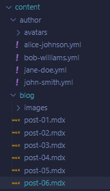

# { frontmatter.title }
Learn the flow of this project by inspecting its items, from index page to the lowest property

## index.astro
*This page displays a grid with all the posts in the blog, avaible to be visited for more details when clicking on the titles.*

It receives blog information by using **getCollection('blog')**.

```javascript
const blogPosts = await getCollection('blog')
```

Then it maps the posts and print them in screen by calling the component **TypedBlogPost** and sending it the posts by props.

```javascript
{
    blogPosts.map((post) => (
    <TypedBlogPost post= {post} />
    ))
}
```

## TypedBlogPost
*This is the component that just displays the image, title and date in index page.*

It receives the post from **Astro.props** and displays the *image*, the *title* and the *date* of the post. The image is being displayed with the Image component.

```javascript
<Image
    class="object-cover w-full h-56 rounded-lg lg:w-64"
    src={frontmatter.image}
    alt={frontmatter.title}
    width={600}
    height={600}
    quality="low"
    loading="lazy"
    transition:name={`${post.slug}-image`}
/>
```


It creates a link with the *slug* value of the post. By clicking on it, the flow calls the **[slug].astro page**.

```javascript
<a href={`/posts/${post.slug}`} />
```

## [slug].astro
*This page, dinamically generated, displays all post data in its own page. Uses Content as a component to print the post.md file on screen (and applying the css styles from the layout).*

It gets the blogPosts info with **getCollection('blog')** and makes the post data available by mapping it on getStaticPaths. 

```javascript
export const getStaticPaths = (async () => {
    const blogPosts = await getCollection('blog')
    return blogPosts.map((post) => (
        {
            params: { slug: post.slug},
            props: { post: post}
        }
    ))
}) satisfies GetStaticPaths;
```

This makes the post data available on **Astro.props** and uses it to paint the md data thru the **BlogCollectionLayout** layout component.

It gets the author.id from the post via **getEntry**.

```javascript
const { Content, headings} = await post.render();
```

It also gets **Content** and **headings** via **post.render** method. Content will be use as component to be sent to the layout, while the heading will be used for a table of contents.

```javascript
const author = await getEntry('author', post.data.author.id);
```

This page paints:

* the header (frontmatter.title).
* the image (frontmatter.image & title).
* Author avatar and name with link to [author] page via his id; (author.data.avatar & name).  
<br />

```javascript
<div class="flex flex-col ml-5">
    <a href={`/blog/${frontmatter.author.id}`}>{author.data.name}</a>
    {Formatter.formatDate(frontmatter.date)}
</div>
```

Additionally, It creates a table of Contents by maping the **heading** value over **li** tags and displying the **heading.text** with **heading-slug** as links to allow navigating by the contents inside the post page.

```javascript
<h3>Tabla de contenidos</h3>
<ol>
    {
        headings.map((heading, index) => (
            <li>
                <a href={`#${heading.slug}`}>{index+1} - {heading.text}</a>
            </li>
        ))
    }
</ol>
```

## [author].astro
*This page dinamically generated by the author.id lists the posts created by this specific authour*

In order to collect and the data from the posts and the author, it requires using the **getStaticPaths** function.  
Inside it, both blogPosts and author collections are requested and then only the posts created by the current author are returned:

```javascript
export const getStaticPaths = (async () => {
    const [authors, posts] = await Promise.all([
        getCollection('author'),
        getCollection('blog'),
    ]);

    return authors.map(author => ({
        params: {author: author.id},
        props: {
            blogPosts: posts.filter(post => post.data.author.id === author.id),
            author: author.data,
        }
    }))

}) satisfies GetStaticPaths;
```
The page, painted by using MainLayout, displays the authors's name and avatar and lists his/her posts by using the **TypedBlogPost** component:

```javascript
{blogPosts.map((post) => <TypedBlogPost post={post} />)}
```

## Additional information
In order to properly work with collections, a config file has to be created containing the structure of the collections and exporting them:

```javascript
import { defineCollection, reference, z } from "astro:content";

const blogCollection= defineCollection({
    type: 'content',
    schema: ({ image }) => z.object({
        title: z.string(),
        date: z.date(),
        description: z.string(),
        //image: z.string(),
        image: image().refine( (img) => img.width > 500, {
            message: 'Image should be greater than 500px',
        }),
        author: reference('author'), // Relation with Author collection
       
        tags: z.array(z.string()), // Relation with tags collection
    }),
});

const authorCollection = defineCollection({
    type: 'data',
    schema: ({ image }) => z.object({
        name: z.string(),
        avatar: image(),
    })
});

export const collections ={
    blog: blogCollection,
    author: authorCollection,
};
```

Also, a **collections folder** is needed, where the config.ts file should be stored as well as the mdx files and the images inside their own folders:  


